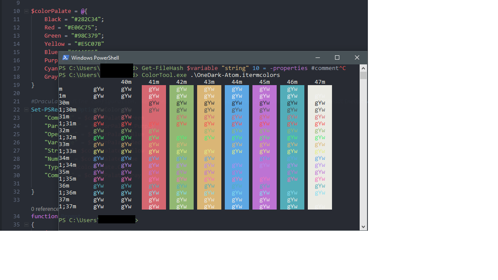

# OneDark-Powershell
> Clone of the famous OneDark theme used in VSCode & Atom

## Requirements
* [Microsoft Color Tool](https://devblogs.microsoft.com/commandline/introducing-the-windows-console-colortool/)
* [PSReadLine >= 2.0](https://www.powershellgallery.com/packages/PSReadline/1.2)

## Installation
###### Terminal Color Profile
In a windows terminal with ColorTool.Exe Added to the system path. Run the following command to apply the terminal color profile.

    ColorTool.exe -b OneDark-Atom.itermcolors
###### Powershell Syntax Highliting 

Add the following lines to your $profile

    $colorPalate = @{
         Black = "#282C34";
        Red = "#E06C75";
        Green = "#98C379";
        Yellow = "#E5C07B"
        Blue = "#61AFEF";
        Purple = "#C678DD";
        Cyan = "#56B6C2";
        Gray = "#ABB2BF"
    }

    # Requires version 2.0
    Set-PSReadlineOption -Color @{
        "Command" = $colorPalate.Green
        "Parameter" = $colorPalate.Purple
        "Operator" = $colorPalate.Blue
        "Variable" = $colorPalate.Red
        "String" = $colorPalate.Yellow
        "Number" = $colorPalate.Blue
        "Type" = $colorPalate.Cyan
        "Comment" = $colorPalate.Gray

    }

